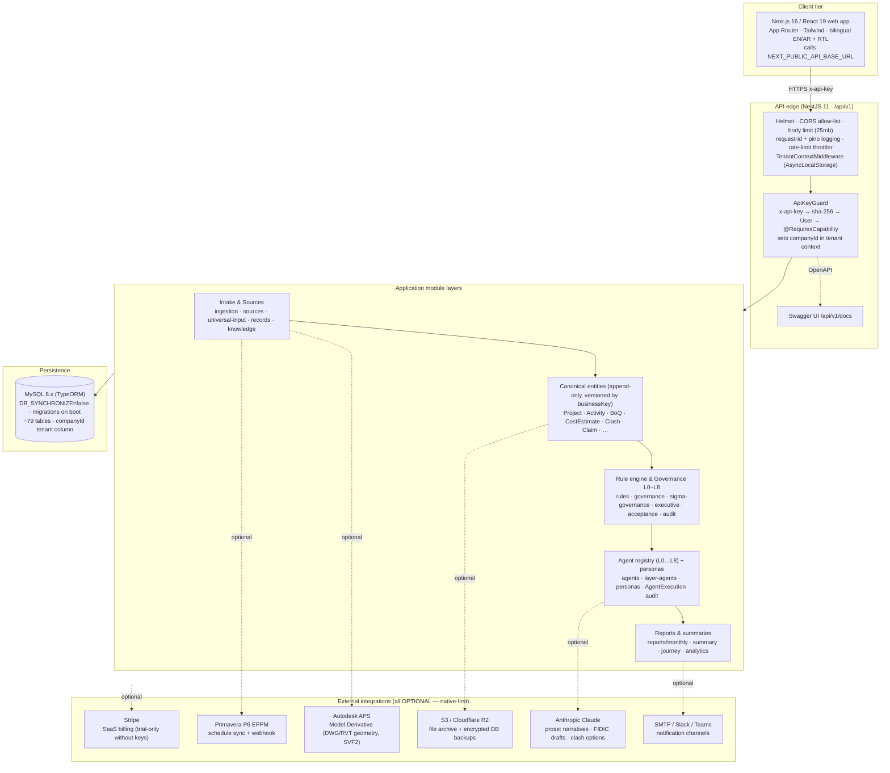
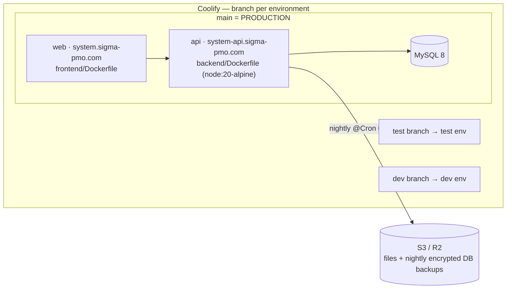

# Sigma PMO — System Architecture

> System architecture of the Sigma PMO platform: the request path from browser to
> database, the module layers, the governance L0–L8 agent taxonomy, and the deployment
> topology. Everything here is derived from the actual codebase (`backend/src/*`,
> `frontend/*`, `Dockerfile`, `RUNBOOK.md`). Companion docs:
> [`FINAL_HANDOVER.md`](../FINAL_HANDOVER.md) · [`RUNBOOK.md`](../RUNBOOK.md) ·
> [`DATA-MODEL-ERD.md`](DATA-MODEL-ERD.md).
>
> **الخلاصة (Arabic summary):** منصّة حوكمة إنشاءات متعددة المستأجرين. الواجهة Next.js
> تنادي واجهة NestJS تحت `/api/v1`. كل طلب يمرّ بمصادقة مفتاح `x-api-key` (SHA-256) ثم
> فحص الصلاحية ثم عزل بيانات الشركة (`companyId`). المنطق حتمي أولاً؛ الذكاء الاصطناعي
> (Claude) اختياري ويكتب النصوص فقط. البيانات في MySQL مع سجلات نسخيّة غير قابلة للحذف.

---

## 1. Context diagram (clients → API → layers → data + integrations)



---

## 2. Layers, in prose

### 2.1 Client tier — `frontend/`
A **Next.js 16 / React 19** App-Router application (Tailwind), fully **bilingual EN/AR with
RTL**. It is a pure API consumer: it holds no business logic of record and talks only to the
backend via `NEXT_PUBLIC_API_BASE_URL` (`…/api/v1`), sending the session `x-api-key` header on
every authenticated call. UI capability gating mirrors `frontend/lib/capabilities.ts`, but the
**backend is the enforcement point** — a hand-crafted request cannot bypass it.

### 2.2 API edge — `backend/src/main.ts`
NestJS 11, global prefix **`/api/v1`**, live OpenAPI at **`/api/v1/docs`**. Cross-cutting
middleware applied before any route: **Helmet** security headers, a **CORS allow-list**
(`CORS_ORIGINS`), a **25 MB body limit** (with a raw-body carve-out for the Stripe webhook so its
signature verifies), a global **`ValidationPipe`** (`whitelist` + `forbidNonWhitelisted` +
`transform`), **pino** structured logging bound to a per-request `x-request-id`, and a **rate-limit
throttler** (returns `429` with `Retry-After`). Time is UTC end-to-end (`TZ=UTC`, driver
`timezone:'Z'`).

### 2.3 Auth &amp; tenant context — `auth/api-key.guard.ts`, `common/tenant/*`
Every write/route protected by `@RequiresCapability(...)` runs the **`ApiKeyGuard`**:

1. Read `x-api-key`; **sha-256** it and look up the active `User` (multi-session: the last few
   key hashes stay valid, so concurrent logins don't evict each other).
2. Check the role → capability matrix (admin overrides merged in memory).
3. Assert the caller's **company is active** (suspended/cancelled/expired-trial → 403; super-admin
   is never gated).
4. Stamp `companyId` onto the request **and** the **AsyncLocalStorage** tenant store. Passwords are
   **scrypt**-hashed; interactive login rotates a fresh key. First-ever boot uses an
   `x-bootstrap-token` path to create the first admin (fail-closed in production).

A global **`TenantContextMiddleware`** opens the tenant store per request; data services then read
`companyScope()` to filter reads and stamp writes by `companyId`, so a tenant only ever sees its own
rows. `companyId = null` (super-admin, cron, scripts) means "unscoped".

### 2.4 Intake &amp; sources — `ingestion`, `sources`, `universal-input`, `records`, `knowledge`, `project-memory`
Files are content-addressed by SHA-256 (`SourceFile`) and archived immutably (local disk or S3/R2).
Each ingest is one **`IngestionRun`** (parse → validate → normalise) that becomes a **version
boundary** for the canonical rows it produces — re-ingesting a file never overwrites prior data.

### 2.5 Canonical entities — `backend/src/modules/canonical/entities/`
The single source of truth: **64 canonical entity classes** (plus a few re-exported from sibling
modules), most extending a `TraceableEntity` base that carries `companyId`, `ingestionRunId`,
`sourceFileId`, `businessKey`, `version`, `isCurrent`, and a verbatim `rawSource`. **Versioned
entities are grouped by `businessKey`, never by surrogate `id`** — re-ingestion inserts `version+1`
and flips `isCurrent` on the prior row. See [`DATA-MODEL-ERD.md`](DATA-MODEL-ERD.md).

### 2.6 Rule engine &amp; governance L0–L8 — `rules`, `governance`, `sigma-governance`, `executive`, `acceptance`, `audit`, `policy-addons`
Deterministic rule evaluation raises **`Alert`**s (each pinned to the exact rows + ingestion run +
source file that triggered it). A `GovernanceDecision` translates an alert into who is accountable,
the FIDIC clause/notice, escalation level, and interventions — **hard-blocked from auto-approval**
for `financial | contractual | safety` categories. Human actions are appended as `DecisionReview`
rows (append-only audit). The **L0–L8 agent taxonomy** (`AgentLayer` enum) is:

| Layer | Name | Role |
|---|---|---|
| L0 | Knowledge | knowledge base, lessons learned, rules library |
| L1 | Data Collection | project records (RFI/Submittal/NCR/…), site evidence |
| L2 | Validation | structural + business validation of ingested data |
| L3 | Compliance | governance policy / FIDIC / authority compliance |
| L4 | Analytics | EVM / KPI / analytics snapshots |
| L5 | Risk | risk register + simulation / what-if |
| L6 | Claims | claims &amp; disputes, forensic evidence chains |
| L7 | Executive | executive overview / consolidated reporting |
| L8 | Sigma Governance | worst-of consolidation + corrective actions |

### 2.7 Agent registry &amp; personas — `agents`, `layer-agents`, `personas`
Every agent run writes one **`AgentExecution`** audit row (agent key, layer, persona slug+version,
target node, input/output refs, confidence, escalation, governance status, `correlationId` threading
an L1→L8 pipeline). This makes any conclusion traceable back to the exact agent + persona version.

### 2.8 Reports — `reports/monthly`, `summary`, `journey`, `analytics`
Deterministic assembly of monthly narrative reports, executive summaries, and the cross-module
**journey** (sketch → feasibility → drawings → BoQ → cost → schedule → claims → decision) threaded by
`journeyCorrelationId`. AI (Claude) only rewrites prose; with no key the report is deterministic-only.

### 2.9 Module inventory
`backend/src/modules/` holds **~68 feature modules** plus the shared `canonical` registry and
`seed`/`validation`/`outbox` infrastructure, exposing **~70 controllers** under `/api/v1`. The
live, exhaustive route + schema list is the **Swagger UI at `/api/v1/docs`**. Grouped overview
(consistent with `FINAL_HANDOVER.md` §5):

- **Auth &amp; platform admin** — `auth`, `admin/capabilities`, `admin/settings`, `admin/claude`, `admin/governance-config`
- **Tenancy / SaaS** — `onboarding`, `super-admin`, `billing`, `analytics`
- **Intake &amp; sources** — `ingestion`, `sources`, `input` (universal), `records`, `knowledge`, `project-memory`
- **Hierarchy &amp; people** — `projects`, `hierarchy`, `org-charts`, `personas`, `agents`
- **Investment &amp; feasibility** — `opportunity`, `feasibility`, `bankability`, `funding`, `revenue`, `predictive`, `comparison`
- **Design / BIM / clash** — `drawings`, `bim`, `clashes`, `integrations/autodesk`
- **Quantities &amp; cost** — `boq`, `quantity-survey`
- **Schedule &amp; scenarios** — `baselines`, `simulation` (+ project CPM)
- **Contract, claims &amp; comms** — `claims`, `contract-rules`, `letters`, `communications`, `communication-rules`, `legal-holds`
- **Safety, quality &amp; operations** — `safety`, `fire-safety`, `quality`, `utility`, `operational-readiness`, `risk`, `authority`, `authority-matrix`
- **Evidence &amp; lifecycle** — `site-evidence`, `evidence`, `journey`
- **Governance &amp; decisions** — `governance`, `governance-command`, `executive`, `rules`, `policy-addons`, `acceptance`, `audit`
- **Reports** — `reports/monthly`, `summary`
- **Procurement &amp; jobs** — `procurement`, `jobs`, `backup`
- **External integrations** — `integrations/p6`, `integrations/autodesk`

---

## 3. Request lifecycle (one authenticated write)

```mermaid
sequenceDiagram
    participant B as Browser (Next.js)
    participant M as Middleware (helmet/cors/tenant/throttle)
    participant G as ApiKeyGuard
    participant S as Service (deterministic-first)
    participant DB as MySQL
    participant AI as Claude (optional)

    B->>M: POST /api/v1/... (x-api-key)
    M->>M: open AsyncLocalStorage tenant store
    M->>G: route requires capability?
    G->>DB: sha-256(x-api-key) → active User
    G->>G: role → capability check + company active?
    G->>M: set companyId in tenant context
    M->>S: dispatch
    S->>DB: read/write scoped by companyId; append version (isCurrent)
    opt AI prose requested AND key present
        S->>AI: summarise / draft (never a decision)
    end
    S-->>B: JSON (ISO-8601 UTC)
```

**Invariants:** authentication is **`x-api-key` → sha-256 → user → capability**; data is **tenant-scoped
by `companyId`**; logic is **deterministic-first** (AI is optional prose only, never an approval);
truth is **append-only** — versioned canonical entities grouped by **`businessKey`** with
`version` + `isCurrent`.

---

## 4. Deployment topology



- **Coolify, branch-per-environment.** `main` = **production** (`system.sigma-pmo.com` web +
  `system-api.sigma-pmo.com` API); separate **`test`** and **`dev`** environments deploy from their
  own branches. *Confirm the target branch before any push.*
- **Images.** Multi-stage **`node:20-alpine`** Docker builds: `npm ci --include=dev` → `npm run
  build` (`nest build`) → `npm prune --omit=dev`; runtime runs `node dist/src/main.js` on port
  **3001**. Supported toolchain: **Node ≥ 20, npm ≥ 10** (npm-only, one lockfile).
- **Config** comes from the Coolify env panel only (never a committed file) — see
  `ENVIRONMENT_VARIABLES.md`.
- **Migrations on boot.** In production `migrationsRun` is on, so a fresh container/volume builds its
  full schema **before serving traffic**; `DB_SYNCHRONIZE` is forced `false` in production regardless
  of config (defence-in-depth). Bookkeeping table: `migrations`.
- **Health.** `GET /api/v1/live` (liveness, no DB), `GET /api/v1/ready` (readiness, DB round-trip),
  `GET /api/v1/health` (alias). See [`runbook/monitoring.md`](runbook/monitoring.md).

---

## 5. Design principles (why it is shaped this way)

- **Deterministic-first.** Rules, governance state, quantities, schedule maths and audit are computed
  deterministically; **Claude** only writes prose and is fully optional (no key ⇒ deterministic-only).
- **Recommend, never auto-decide.** Financial / contractual / safety decisions are hard-blocked from
  auto-approval and require explicit human sign-off.
- **Append-only truth + traceability.** Versioned entities grouped by `businessKey`, an evidence /
  confidence ledger, and cross-module journey correlation.
- **Multi-tenant SaaS.** Companies self-register; data isolated by `companyId`; a super-admin governs
  the platform.
