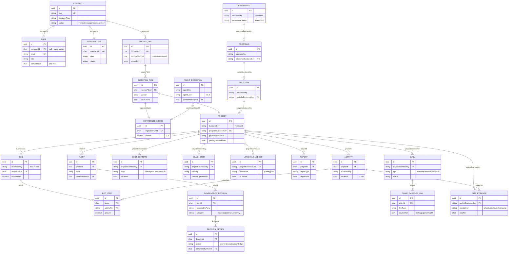

# Sigma PMO — Data Model &amp; ERD

> The canonical data model: an entity-relationship diagram of the core entities, the full table
> inventory, and the append-only / multi-tenant conventions. Derived directly from
> `backend/src/modules/canonical/entities/*.entity.ts` (and the sibling-module entities re-exported
> through the canonical barrel). Companion: [`ARCHITECTURE.md`](ARCHITECTURE.md).
>
> **الخلاصة (Arabic summary):** نموذج البيانات مبني على "الكيانات الأساسية" (canonical entities).
> معظمها نسخيّ غير قابل للحذف: كل تعديل صف جديد بنسخة أعلى (`version`) مع `isCurrent`، والتجميع
> يكون دائماً بـ `businessKey` وليس بالـ `id`. كل صف مربوط بمصدره (`sourceFileId` + `ingestionRunId`)
> ومعزول حسب الشركة (`companyId`).

---

## 1. Counts (as found in the code)

| Metric | Value | Source |
|---|---|---|
| Entity classes in `canonical/entities/` | **64** | `backend/src/modules/canonical/entities/` |
| Additional entity classes in sibling modules | **+14** — 4 re-exported through the canonical barrel (`source`, `outbox_events`, `letter`, `org_chart_review`) + 10 owned by their own modules (evidence×4, legal-hold×2, communications×2, `input_proposal`, `audit_log`) | grep `@Entity(...)` |
| Total `@Entity` tables | **78** | grep `@Entity(...)` across `backend/src/**/*.entity.ts` |
| + TypeORM migrations bookkeeping table (`migrations`) | **+1** | `database.module.ts` (`migrationsTableName`) |
| **Total physical tables** | **≈ 79** | matches the restore-verify drill (79 tables) |

> The abstract `common/entities/base.entity.ts` (`UuidEntity`, `TraceableEntity`) defines no table —
> it is inherited by the concrete entities below.

---

## 2. Core ERD (~20 central entities)

> Relationships in the code are **logical / application-enforced soft keys** (an `id` or a
> `businessKey` stored as a column), not TypeORM `@ManyToOne` graph relations — this is deliberate,
> because versioned append-only rows cannot share a single hard DB foreign key. The diagram shows the
> logical links; the join column is on each edge.

---

## 3. Append-only versioning &amp; tenant convention

Most canonical entities extend **`TraceableEntity`** (`common/entities/base.entity.ts`), which adds:

| Column | Meaning |
|---|---|
| `companyId` | **Multi-tenant scope.** Stamped from the caller's company context on every write; `null` = platform/super-admin. Reads are filtered by `companyScope()`. Indexed. |
| `ingestionRunId` | The run that produced this row (version boundary). |
| `sourceFileId` | The archived source file — root of the traceability chain. |
| `businessKey` | Natural key from the source (project id, activity code, …). **Roll-ups group by this, never by `id`.** |
| `version` + `isCurrent` | Append-only versioning: re-ingesting inserts `version+1` and flips `isCurrent` on the prior row. Old rows are retained as history. |
| `rawSource` | The original parsed payload, verbatim, for "why is this value here?" audit. |

Entities that are events/audits rather than versioned facts (e.g. `Alert`, `DecisionReview`,
`AgentExecution`, `LifecycleLedgerEntry`) extend the lighter **`UuidEntity`** (uuid `id` +
`createdAt`) and are themselves append-only by nature. Some of these carry their own `companyId`
(e.g. `site_evidence`, `claim_evidence_link`, `ingestion_run`, `source_file`) for defence-in-depth.

---

## 4. Full table inventory

**A. Canonical entities** (`backend/src/modules/canonical/entities/`, 64 tables)

| Table | Purpose (1-line) |
|---|---|
| `source_file` | Ingested file, content-addressed by SHA-256; immutable archive; root of traceability. |
| `ingestion_run` | One parse→validate→normalise execution; the version boundary for produced rows. |
| `confidence_score` | Reproducible data-confidence score (0–1) per ingestion run. |
| `project` | Canonical project; top of Project→Activity; carries hierarchy ancestry + governance status. |
| `activity` | Schedule task within a project; CPM logic (float, critical, predecessors). |
| `resource` | Canonical resource (labour/plant/material) from the schedule. |
| `resource_assignment` | Assignment of a resource to an activity. |
| `report` | Progress report submission (daily/weekly/monthly) with metrics + narrative. |
| `alert` | Rule-engine finding pinned to the exact rows + ingestion run that triggered it. |
| `rule_evaluation` | One run of the rule engine; groups the alerts it produced. |
| `executive_summary` | Executive/consolidated summary snapshot. |
| `governance_policy` | Versioned governance policy (thresholds, escalation, FIDIC mapping). |
| `governance_decision` | Decision for an alert: responsible party, FIDIC clause, escalation, category. |
| `decision_review` | Append-only human action on a decision (approve/reject/acknowledge). |
| `user` | RBAC principal; `x-api-key` (sha-256) + scrypt password; role + scopes; `companyId`. |
| `company` | Multi-tenant SaaS tenant account (slug, type, status, plan). |
| `subscription` | Per-company subscription (plan, status, seats, Stripe linkage). |
| `support_request` | Tenant support / contact request ticket. |
| `persona` | AI persona definition (slug + versioned prompt/rules) an agent runs under. |
| `scenario` | Simulation / what-if scenario record. |
| `clash_item` | BIM/Revit clash row with 3 proposed options + geometry/location detail. |
| `boq` | Bill of Quantities header; `businessKey` bound to a project; total amount. |
| `boq_item` | BoQ line (qty, unit rate, amount) with classification + pricing provenance. |
| `baseline_build_job` | Async job that builds a schedule baseline from drawings/BoQ. |
| `monthly_report` | Monthly narrative report artefact (bilingual). |
| `system_setting` | Runtime settings store (e.g. encrypted Claude API key entry). |
| `project_policy_addon` | Project-scoped AI/governance instructions authored inline. |
| `project_memory` | Project "understudy" memory context. |
| `drawing_package` | Ingested drawings package (phase-1 BIM intake). |
| `output_comparison` | AI-vs-human output comparison record. |
| `enterprise` | Top governance level (Enterprise→Portfolio→Program→Project); rolled-up status. |
| `portfolio` | 2nd governance level; links to enterprise by businessKey. |
| `program` | 3rd governance level; aggregates related projects. |
| `agent_execution` | Central audit row for every agent run (layer, persona, confidence, correlationId). |
| `governance_status_snapshot` | Append-only 4-tier governance-status snapshot per node. |
| `lessons_learned` | L0 knowledge — lessons-learned entries. |
| `analytics_snapshot` | L4 analytics — append-only EVM/KPI snapshots. |
| `risk` | L5 risk register entry. |
| `claim` | L6 potential contractual claim (EOT/cost/variation/disruption) + evidence refs. |
| `corrective_action` | L8 Sigma-governance corrective action. |
| `role_capability_override` | Admin runtime override of a role→capability. |
| `project_record` | L1 polymorphic project record (RFI/Submittal/NCR/Change/Procurement/…). |
| `investment_opportunity` | Idea-stage investment opportunity (welds to the construction project). |
| `feasibility_assessment` | Feasibility assessment run. |
| `feasibility_study_section` | Versioned feasibility study section. |
| `concept_document` | Concept-sketch document with human-gated AI extraction. |
| `cost_estimate` | Append-only QS cost estimate per lifecycle stage + classification standard. |
| `qs_finding` | Quantity-survey governance finding. |
| `vendor` | Vendor registry entry. |
| `procurement_package` | Procurement package. |
| `procurement_finding` | Procurement governance finding. |
| `lifecycle_ledger` | Quantity/cost traceability ledger (append-only BIM→…→Paid / Budget→…→Final). |
| `opportunity_screening` | Pre-feasibility opportunity screening. |
| `funding_facility` | Funding facility (DSCR/covenants/drawdown). |
| `safety_record` | Safety governance record. |
| `fire_safety_record` | Fire &amp; life-safety governance record. |
| `authority_submission` | Authority submission/approval tracking. |
| `utility_connection` | Utility connection governance record. |
| `operational_readiness_item` | Operational-readiness governance item. |
| `quality_record` | QA/QC record (NCR/ITP/inspection) with NCR→delay/cost/claim chain. |
| `authority_matrix_entry` | Contractual authority matrix (who may do which action). |
| `contract_clause_rule` | Contract clause rule (notice/time-bar/deemed-approval/determination). |
| `site_evidence` | Site capture (photo/video/audio/transcript) with rich metadata; daily rollup. |
| `claim_evidence_link` | One cited piece of evidence on a forensic claim chain (source-ref'd). |

**B. Sibling-module entities** (14 tables). The first four are re-exported through the canonical
barrel (`entities/index.ts`) for import convenience; the rest are owned entirely by their own modules.

| Table | Module | Purpose (1-line) |
|---|---|---|
| `source` | `sources/` | Curated reference catalogue (FIDIC, PMI, ISO, …). *(re-exported)* |
| `letter` | `letters/` | FIDIC governance letter artefact. *(re-exported)* |
| `org_chart_review` | `org-charts/` | PMI-compliance org-chart review row. *(re-exported)* |
| `outbox_events` | `outbox/` | Durable cross-layer event bus row (ADR-0012). *(re-exported)* |
| `communication` | `communications/` | Stakeholder communication record. |
| `communication_rule` | `communications/` | Communication routing/governance rule. |
| `evidence_room` | `evidence/` | Evidence room (container for evidence files). |
| `evidence_file` | `evidence/` | Evidence file within a room. |
| `evidence_item` | `evidence/` | Evidence item (indexed fact). |
| `evidence_chunk` | `evidence/` | Chunk of an evidence file (retrieval unit). |
| `legal_hold` | `legal-hold/` | Legal hold placed on evidence. |
| `custody_event` | `legal-hold/` | Chain-of-custody event. |
| `input_proposal` | `universal-input/` | Universal-input proposal awaiting human confirmation. |
| `audit_log` | `audit/` | System audit log. |

**C. Infrastructure table** (1)

| Table | Purpose |
|---|---|
| `migrations` | TypeORM migration bookkeeping (applied migrations ledger). |

**Total: 78 application tables + `migrations` = ≈ 79 physical tables**, consistent with the
restore-verify drill.
