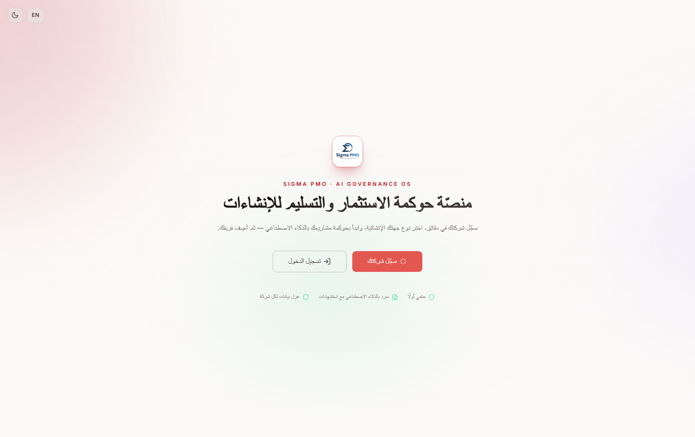
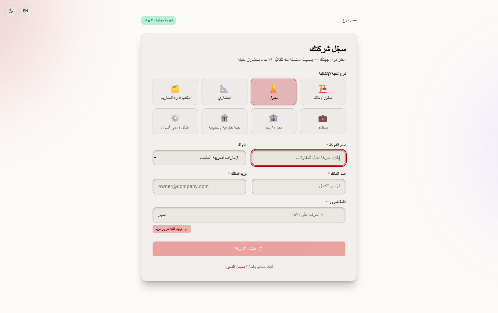
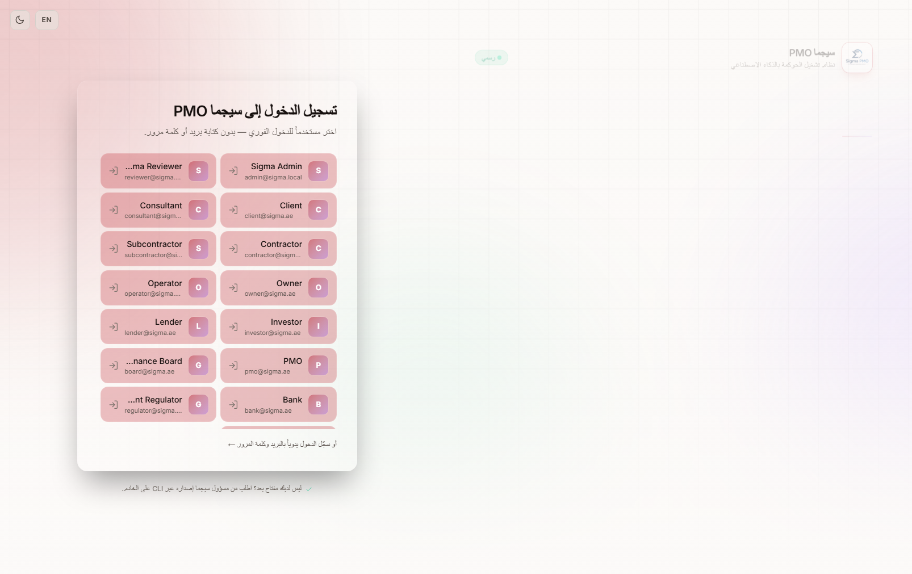
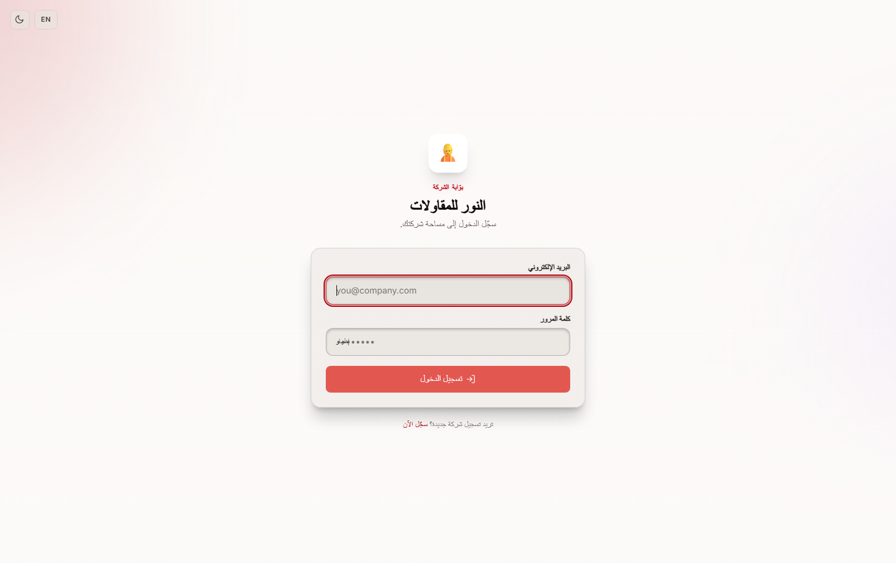
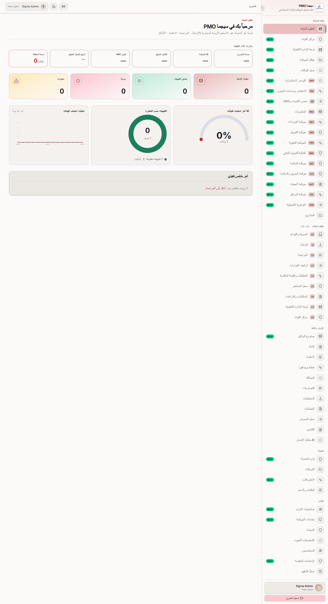
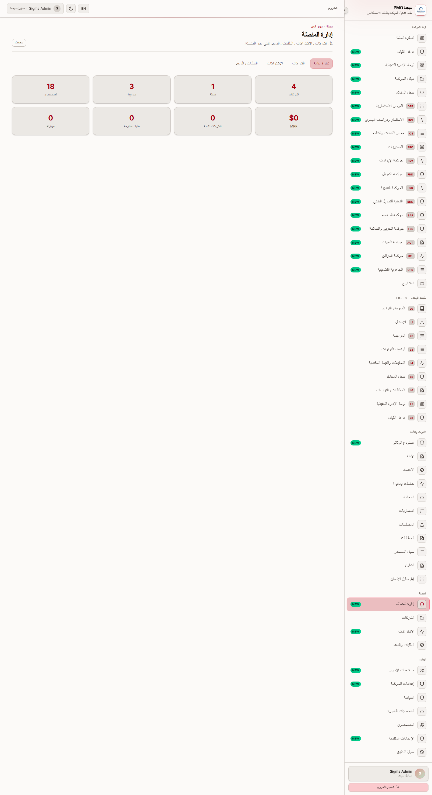
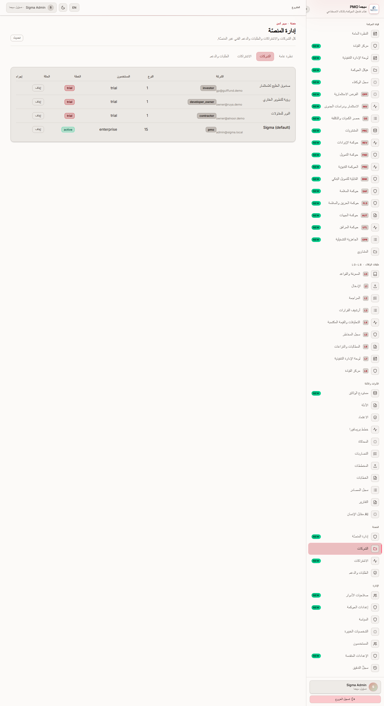
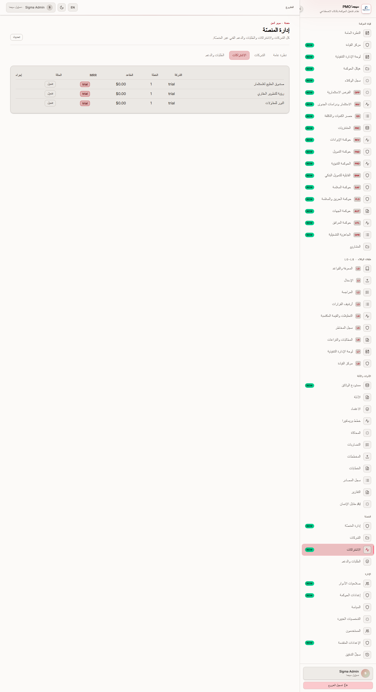
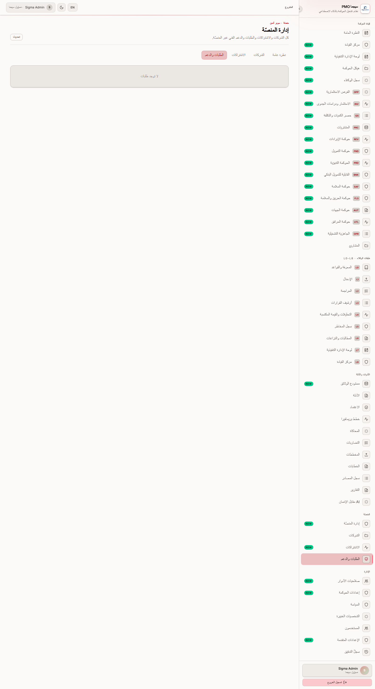

# منصّة سيجما PMO — دليل المعمارية كخدمة (SaaS) وإدارة الاشتراكات والوصول

هذا المستند يوثّق تحوّل **سيجما PMO** إلى منصّة **متعدّدة المستأجرين (Multi-Tenant SaaS)** جاهزة للنموذج التجاري بالاشتراكات، ويجيب على كل النقاط التي طلبها المهندس أيهم: الهيكلة، عزل البيانات، إدارة الاشتراكات، تحكّم المسؤول، الأمان، الاستضافة والنشر، الجاهزية التجارية، والملكية والنطاق — مع توضيح **ما هو منفَّذ بالكامل، وما هو جزئي، وما يحتاج تطويراً مستقبلياً**.

> النظام يعمل فعلياً الآن (Live) على الخادم، وكل اللقطات في هذا الدليل مأخوذة من النسخة المنشورة مباشرةً.

---

## 1. الوصول إلى المنصّة

**رابط المنصّة (الواجهة):** https://system.sigma-pmo.com
**رابط الواجهة البرمجية (API):** https://system-api.sigma-pmo.com/api/v1

طريقة الدخول الجديدة سهلة جداً: في صفحة الدخول **تختار المستخدم من قائمة بضغطة واحدة** فيدخل فوراً دون كتابة بريد أو كلمة مرور — مهيّأة للعرض والتجربة. وفيما يلي كل الحسابات التجريبية (15 دوراً) ببياناتها، نمط كلمة المرور: `<الدور>Sigma#2026`.

نصيحة: هذه حسابات تجريبية للعرض فقط؛ يُنصح بتدويرها (تغييرها) قبل التشغيل التجاري الفعلي، ويمكن إخفاء قائمة الاختيار في الإنتاج عبر ضبط `NEXT_PUBLIC_DEMO_LOGIN=false`.

- **أدمن سيجما** — `admin@sigma.local` — `AdminSigma#2026`
- **مراجع سيجما** — `reviewer@sigma.local` — `ReviewerSigma#2026`
- **العميل (الأيهم)** — `client@sigma.ae` — `ClientSigma#2026`
- **استشاري** — `consultant@sigma.ae` — `ConsultantSigma#2026`
- **مقاول رئيسي** — `contractor@sigma.ae` — `ContractorSigma#2026`
- **مقاول باطن** — `subcontractor@sigma.ae` — `SubcontractorSigma#2026`
- **المالك** — `owner@sigma.ae` — `OwnerSigma#2026`
- **المشغّل** — `operator@sigma.ae` — `OperatorSigma#2026`
- **مستثمر** — `investor@sigma.ae` — `InvestorSigma#2026`
- **مموّل/مقرض** — `lender@sigma.ae` — `LenderSigma#2026`
- **مكتب PMO** — `pmo@sigma.ae` — `PmoSigma#2026`
- **مجلس الحوكمة** — `board@sigma.ae` — `BoardSigma#2026`
- **البنك** — `bank@sigma.ae` — `BankSigma#2026`
- **الجهة الرقابية** — `regulator@sigma.ae` — `RegulatorSigma#2026`
- **مدير الأصول** — `assetmgr@sigma.ae` — `AssetMgrSigma#2026`

---

## 2. رحلة الاستخدام بالصور

تبدأ الرحلة من صفحة الترحيب، ثم تسجيل الشركة، ثم الدخول، وصولاً إلى لوحة التحكّم.

### صفحة الترحيب — `/intro`

أول واجهة يراها الزائر: تعريف بالمنصّة كنظام تشغيل للحوكمة بالذكاء الاصطناعي، مع زرّين: **سجّل شركتك** و**تسجيل الدخول**.

### تسجيل شركة جديدة — `/register`

الشركة تسجّل نفسها ذاتياً: تختار **نوع الكيان الإنشائي** (مالك/مطوّر، مقاول، استشاري، مكتب PMO، مستثمر، مموّل، جهة حكومية، مشغّل) — وهذا الاختيار **يهيّئ المنصّة تلقائياً** بالأدوار والوحدات المناسبة لها — ثم تنشئ أول مسؤول، وتبدأ فترة تجريبية مجانية 30 يوماً.

### بوابة الدخول — `/auth`

الدخول بالاختيار: قائمة المستخدمين/الأدوار، اختر واحداً فتدخل فوراً. كما تتوفّر بوابة دخول **خاصة بكل شركة** على المسار `‎/c/<اسم-الشركة>` بحيث يدخل منها مستخدمو تلك الشركة فقط.

### لوحة التحكم — `/`

بعد الدخول تظهر لوحة القيادة: مؤشّرات الأداء التنفيذية، التنبيهات، عمليات الإدخال، وكل طبقات الحوكمة (L0–L8) في الشريط الجانبي — كلٌّ حسب صلاحيات دور المستخدم.

---

## 3. هيكلة الـSaaS متعدّدة المستأجرين

**هل سيجما الآن منصّة SaaS متعدّدة المستأجرين؟** نعم — بشكل كامل. الكيان المركزي هو **الشركة (Company / Tenant)**: كل شركة هي مساحة عمل مستقلّة لها مستخدموها وأدوارها ومشاريعها وبياناتها.

**هل يمكن لكل عميل مساحة عمل ومشاريع ومستخدمين وأدوار وبيانات منفصلة؟** نعم:

- **مساحة عمل منفصلة:** كل شركة كيان مستقل (جدول `company`).
- **مستخدمون وأدوار:** لكل شركة مستخدموها، وكل مستخدم له دور من 15 دوراً، وصلاحيات قابلة للضبط لكل شركة عبر تجاوزات الصلاحيات (`role_capability_override`).
- **مشاريع وبيانات:** كل مشروع وكل سجلّ حَوْكَمي مربوط بالشركة عبر `companyId`.

**هل يمكن إدارة الاشتراكات لكل عميل أم لكل مشروع أم لكل مؤسّسة؟** الاشتراك يُدار **على مستوى الشركة/المؤسّسة (per organization)** — اشتراك واحد لكل شركة يحدّد الخطة وعدد المقاعد والحالة. (الاشتراك لكل مشروع منفصل غير مطبّق حالياً وهو تحسين مستقبلي إن لزم.)

---

## 4. عزل المستأجرين والبيانات

**كيف تُفصَل بيانات كل عميل؟** عبر ثلاث طبقات متكاملة:

1. **معرّف الشركة في قاعدة البيانات:** عمود `companyId` موجود على الجداول الأساسية الحاملة للبيانات (المشاريع، الأنشطة، الموارد، التقارير، التنبيهات، المؤسّسة/المحفظة/البرنامج، سجلّات المشاريع، عمليات الإدخال، الفرص الاستثمارية ودراسات الجدوى…) وعلى جدول المستخدمين نفسه.
2. **سياق المستأجر لكل طلب (Tenant Context):** عند كل طلب، تفتح وسيطة (Middleware) سياقاً معزولاً، ويملؤه حارس المصادقة بمعرّف شركة المستخدم، فتقوم خدمات البيانات بترشيح كل استعلام تلقائياً على شركة المستخدم (`companyScope`).
3. **حارس نطاق المشروع (Project Scope Guard):** حارس عام يرفض أي طلب يحمل مفتاح مشروع لا تملكه الشركة، ويُرجِع **403 (ممنوع)**، مع فحص ملكية إضافي عند القراءة بالمعرّف.

**هل يمكن لعميل الوصول لبيانات عميل آخر تحت أي ظرف؟** لا. تم التحقق عملياً: شركة جديدة ترى **صفر** عبر كل الشاشات (المشاريع، الإدخال، الهيكل، التحليلات، المخاطر، القرارات، التدقيق، الجدوى، الفرص…)، وأي محاولة للوصول لمشروع شركة أخرى تُحجب بـ403/404.

**هل يوجد Tenant ID / Organization ID في بنية قاعدة البيانات؟** نعم — `companyId` (معرّف 36 خانة) على الجداول، بالإضافة إلى جدول `company` المستقل، وجدول `subscription` لكل شركة.

---

## 5. إدارة الاشتراكات

النظام يتضمّن أربع خطط (`trial` تجريبية، `starter`، `pro`، `enterprise`) لكلٍّ منها سقف مقاعد ومستوى مزايا، ويتكامل مع **Stripe** للدفع والتجديد. حالة كل بند:

- **خطط الاشتراك (Subscription plans):** ✅ منفّذ — أربع خطط بأسعار وسقوف مقاعد ومزايا.
- **حسابات نشطة/غير نشطة (Active/Inactive):** ✅ منفّذ — حالة الشركة (`trial / active / suspended / cancelled`) وحالة الاشتراك (`trial / active / past_due / cancelled`).
- **حسابات تجريبية (Trial):** ✅ منفّذ — فترة تجريبية 30 يوماً مع تاريخ انتهاء التجربة.
- **حدود المستخدمين (User limits):** ✅ منفّذ — سقف المقاعد لكل خطة مُطبَّق فعلياً؛ تجاوزه عند إضافة مستخدم يُرفَض بـ403.
- **تواريخ الانتهاء (Expiry dates):** ✅ منفّذ كحقول (نهاية التجربة + نهاية الدورة الحالية) ومتزامنة من Stripe — **جزئي** في فرض الإيقاف التلقائي الصارم عند الانتهاء.
- **التحكّم بالتجديد (Renewal control):** ✅ منفّذ عبر Stripe (تجديد تلقائي + بوابة إدارة الفوترة)، ويمكن للمسؤول تغيير حالة الاشتراك.
- **الوصول حسب الخطة (Role/plan-based access):** ⚠️ **جزئي** — التحكّم بالوصول حسب **الدور** منفّذ بالكامل؛ أما قَفْل **الوحدات حسب مزايا الخطة** فمُعرَّف في الخطط لكنه لم يُفعَّل بالكامل في الواجهة بعد.
- **حدود المشاريع (Project limits):** 🔜 **مستقبلي** — الخطط تحدّ المقاعد لا عدد المشاريع حالياً.

---

## 6. تحكّم المسؤول (Super Admin)

توجد طبقة **مسؤول منصّة (SUPER ADMIN)** فوق كل الشركات (صلاحية `canManagePlatform`)، لها لوحة تحكّم (الشركات / الاشتراكات / الطلبات والدعم / تحليلات المنصّة). قدرات المسؤول:

- **إنشاء العملاء/المؤسّسات:** ✅ عبر التسجيل الذاتي للشركات (`/onboarding/register`)؛ المسؤول يدير كل الشركات ويراها. (إنشاء شركة يدوياً من لوحة المسؤول مباشرةً = تحسين بسيط مستقبلي.)
- **تعيين خطط الاشتراك:** ✅ يدير حالة/خطة الاشتراك لكل شركة من لوحة المسؤول؛ والتعيين يتم أيضاً عند التسجيل وعبر Stripe.
- **تفعيل/تعطيل الحسابات:** ✅ منفّذ — إيقاف/تفعيل أي شركة من اللوحة.
- **التحكّم بوصول المستخدمين:** ✅ منفّذ — الأدوار والصلاحيات وتجاوزات الصلاحيات وإدارة المستخدمين.
- **مراجعة الاستخدام:** ✅ منفّذ (تحليلات: عدد الشركات، المستخدمين، الإيراد الشهري MRR، النشطة/التجريبية، الطلبات المفتوحة) — مراجعة استخدام تفصيلية لكل عميل = **جزئي**.
- **تعليق/إعادة تنشيط الاشتراكات:** ✅ منفّذ من لوحة الاشتراكات وحالة الشركة.

---

## 7. الأمان

بما أن عدّة عملاء قد يستخدمون نفس المنصّة، يقوم الأمان على:

- **الوصول حسب الدور (Role-based access):** ✅ منفّذ — 15 دوراً، مصفوفة صلاحيات مفصّلة، حارس مصادقة + فحص قدرة لكل نقطة، وتجاوزات صلاحيات وقت التشغيل.
- **فصل المستأجرين (Tenant separation):** ✅ منفّذ — `companyId` + سياق المستأجر لكل طلب + حارس نطاق المشروع.
- **التحكّم بالوصول للملفات:** ⚠️ **جزئي** — التخزين معنوَن بالمحتوى (SHA-256) على R2/قرص، والوصول محكوم بملكية المشروع/الشركة على مستوى الـAPI؛ تقسيم طبقة التخزين نفسها لكل شركة = تحسين مستقبلي.
- **سجلّات التدقيق (Audit logs):** ✅ منفّذ — قرارات الحوكمة ومراجعاتها، سجلّ التتبّع المتسلسل (append-only)، ونقطة `/audit` مُرشَّحة بمعرّف الشركة، مع تسجيل لكل طلب (request-id).
- **النسخ الاحتياطي (Backup):** ✅ منفّذ — نسخ منطقية **مشفّرة AES-256-GCM** إلى التخزين السحابي (Cloudflare R2 / متوافق S3) + سكربت استرجاع + تمرين استرجاع دوري.
- **الاحتفاظ بالبيانات (Data retention):** ⚠️ **جزئي** — مدة احتفاظ النسخ قابلة للضبط (14 يوماً افتراضياً) + سجلّات غير قابلة للتعديل؛ سياسة احتفاظ رسمية لكل مستأجر = مستقبلي.
- **سجلّات نشاط المستخدم (User activity logs):** ⚠️ **جزئي** — تسجيل منظَّم لكل طلب + تدقيق إجراءات الحوكمة؛ خط زمني تفصيلي كامل لكل مستخدم = مستقبلي.

> التشفير عند التخزين: كل الأسرار الحسّاسة (مفتاح Claude، روابط التكامل…) تُشفَّر AES-256-GCM في قاعدة البيانات ولا تُعاد أبداً كنص صريح؛ ومفاتيح الاتصال (التخزين، الفوترة) تبقى في متغيّرات البيئة على الخادم فقط، وليست في الشيفرة أو المستودع.

---

## 8. الاستضافة والنشر

- **أين تُستضاف نسخة الـSaaS؟** على خادم خاص (VPS) عبر **Coolify** بحاويات **Docker** (ثلاث خدمات منفصلة: قاعدة بيانات MySQL لها وحدة تخزين خاصة + خدمة الواجهة الخلفية + خدمة الواجهة)، خلف وكيل عكسي بشهادة SSL. النطاق الحالي: `system.sigma-pmo.com` (الواجهة) و`system-api.sigma-pmo.com` (الـAPI). الملفات والنسخ المشفّرة على Cloudflare R2.
- **هل يدعم عدّة عملاء على نشرة واحدة؟** ✅ نعم — نشرة واحدة تخدم كل الشركات بعزل كامل (Multi-Tenant).
- **هل يمكن لكل عميل نشرة مخصّصة منفصلة عند الطلب؟** ✅ نعم — نفس حزمة Docker يمكن نشرها كنسخة مستقلّة تماماً لعميل بعينه (Single-Tenant / Dedicated).
- **النسخ والاسترجاع:** نسخ مشفّرة مجدولة إلى R2/S3 + سكربت استرجاع (`restore-db-from-s3`) + تمرين تحقّق دوري.
- **النشر والتحديث:** دفع الكود إلى Git → بناء تلقائي على Coolify → **تشغيل تلقائي للـMigrations عند الإقلاع** يبني السكيمة كاملة (64 جدولاً) على أي قاعدة جديدة + زرع البيانات التأسيسية، مع خط تكامل مستمر (CI) يفحص الأنواع ويشغّل الاختبارات.

---

## 9. الجاهزية التجارية وسير العمل

- **سير الاشتراك (Subscription workflow):** تسجيل الشركة → فترة تجريبية 30 يوماً → (للخطط المدفوعة) تحويل إلى Stripe Checkout → اشتراك نشط → تجديد تلقائي/إلغاء عبر بوابة الفوترة.
- **سير انضمام العميل (Client onboarding):** `/onboarding/register` → اختيار نوع الكيان (يهيّئ الإعدادات) → إنشاء أول مسؤول → بوابة دخول خاصة بالشركة `‎/c/<slug>`.
- **سير انضمام المستخدم (User onboarding):** مسؤول الشركة يضيف المستخدمين (دور + ضمن سقف المقاعد) → المستخدمون يسجّلون الدخول.
- **سير تحكّم المسؤول بالاشتراكات:** لوحة المسؤول (الشركات / الاشتراكات / الطلبات والدعم / التحليلات) لإيقاف/تفعيل وتعديل الحالة ومراجعة المؤشّرات.
- **افتراضات أمن البيانات:** عزل على مستوى الشركة في كل استعلام؛ الأسرار في البيئة/مشفّرة فقط؛ النسخ مشفّرة؛ الوصول محكوم بالدور والملكية.
- **القيود الحالية (Current limitations):** قَفْل الوحدات حسب الخطة، وحدود المشاريع، والإيقاف التلقائي الصارم عند انتهاء الاشتراك، وسجلّ نشاط المستخدم التفصيلي، وتقسيم تخزين الملفات لكل مستأجر — كلها بنود **جزئية أو مستقبلية** (انظر الملخّص).

---

## 10. الملكية والنطاق

نؤكّد أن **كل ما يخص قدرة الـSaaS** — التطوير، ومنطق الاشتراكات، وبنية قاعدة البيانات، والشيفرة المصدرية، والإعدادات، والتوثيق — هو **جزء كامل من سيجما PMO ومشمول ضمن النطاق المُسلَّم الحالي دون أي تكلفة إضافية**، كما سبق الاتفاق. هذه القدرة تحوّل سيجما من منصّة لمشروع واحد إلى **منتج تجاري قابل للتوسّع** متعدّد العملاء.

---

## 11. ملخّص الحالة: منفَّذ / جزئي / مستقبلي

**✅ منفَّذ بالكامل:**
- بنية متعدّدة المستأجرين (شركة كمستأجر) + `companyId` + سياق مستأجر لكل طلب + حارس نطاق المشروع.
- عزل بيانات محقّق ومُختبَر (لا تسرّب بين الشركات).
- التسجيل الذاتي للشركات حسب نوع الكيان + بوابة دخول لكل شركة + الدخول بالاختيار.
- خطط الاشتراك + التجربة 30 يوماً + حدود المقاعد + حالات نشط/موقوف/ملغى + تكامل Stripe (دفع/تجديد/بوابة).
- لوحة مسؤول المنصّة (شركات/اشتراكات/طلبات/تحليلات) + إيقاف/تفعيل.
- الأمان: الوصول بالدور، التدقيق، النسخ المشفّرة إلى R2/S3، تشفير الأسرار.
- النشر بحاويات Docker + Migrations تلقائية + CI.

**⚠️ جزئي:**
- قَفْل الوحدات حسب مزايا الخطة (مُعرَّف، غير مُفعَّل بالكامل في الواجهة).
- الإيقاف التلقائي الصارم عند انتهاء الاشتراك (الحالة تتزامن، اللوكاوت جزئي).
- التحكّم بالوصول للملفات على مستوى التخزين، والاحتفاظ بالبيانات، وسجلّ نشاط المستخدم التفصيلي، ومراجعة الاستخدام التفصيلية لكل عميل.

**🔜 تحسينات مستقبلية:**
- حدود المشاريع لكل خطة.
- إنشاء الشركات وتعيين الخطط يدوياً من لوحة المسؤول مباشرةً.
- تقسيم تخزين الملفات لكل مستأجر، وسياسة احتفاظ رسمية لكل مستأجر.

> الخلاصة: **جوهر منتج الـSaaS متعدّد المستأجرين — معزول، مؤمّن، مُدار بالاشتراك، ومنشور ويعمل فعلياً.** والبنود الجزئية/المستقبلية تحسينات على الحافة لا تمنع التشغيل التجاري.
